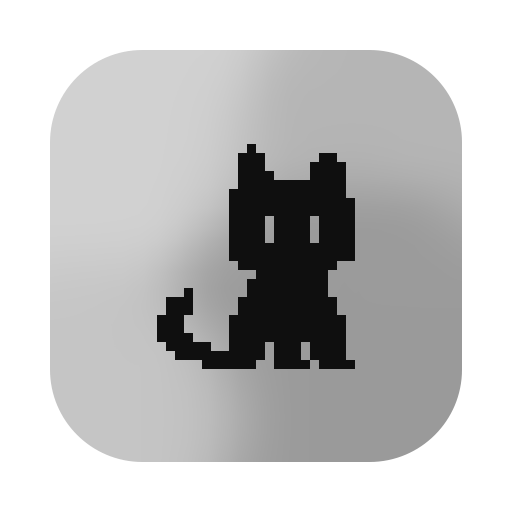
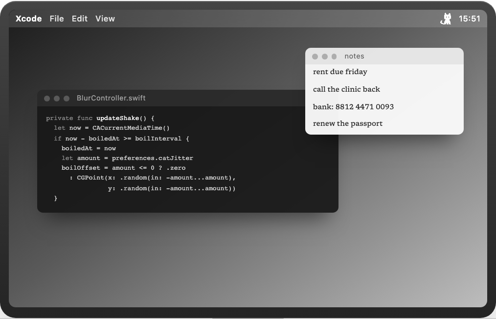
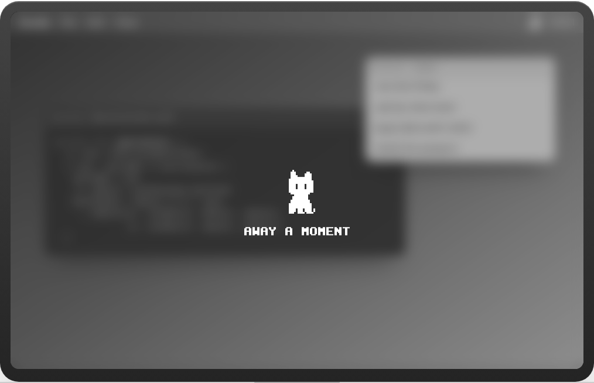

<p align="center"></p>

<h1 align="center">Away Blur</h1>

<p align="center">
Walk away from your Mac and the screen frosts over.<br>
Touch a key when you're back and it's gone.
</p>

<p align="center">
<a href="https://github.com/t42ji2ji/away-blur/releases/latest/download/Away-Blur.dmg"><b>Download for Mac</b></a>
 · <a href="https://awayblur.dorara.app">Website</a>
<br><sub>macOS 14 or later · Apple silicon and Intel · free</sub>
</p>

<table>
<tr>
<td></td>
<td></td>
</tr>
<tr>
<td align="center">You, at your desk</td>
<td align="center">You, getting coffee</td>
</tr>
</table>

## Why

You get up for a minute. Your messages, your bank tab, the code you are not
supposed to show anyone yet stay on the screen for whoever walks past. Locking
the Mac every time is a password every time, so most of the time nobody does it.

Away Blur covers the screen instead of locking it. No password, no waiting:
touch any key or move the mouse and you are back where you were.

## What you get

- **It notices you left.** No keyboard or mouse for a minute and a half (or
  however long you choose) and the screen frosts.
- **It doesn't blur your movie.** Anything playing video or on a call is
  keeping the display awake, and while it does, Away Blur waits. You can sit
  through a film without touching anything.
- **Leaving on purpose.** Press <kbd>⌥</kbd><kbd>⇧</kbd><kbd>⌘</kbd><kbd>B</kbd>
  as you stand up and it frosts right away. You get four seconds to let go of
  the keys.
- **Two looks.** *Privacy* turns the screen into an unreadable dark blur in
  under half a second. *Ambient* is a soft frost that drifts in slowly, so you
  can still tell roughly what's there. One strength setting, 1 to 5, makes
  either one lighter or heavier.
- **A cat keeps watch.** A small pixel cat sits in the middle of the frost. Every so
  often it stretches, yawns, paws at the frost or pounces, and after ten
  minutes it lies down to sleep.
- **A line for whoever glances over.** Under the cat: how long you've been gone,
  the time, the battery.
- **Your agents, at a glance.** If you use Claude Code or Codex, each session
  gets a small dot under the cat: orange while it's working, green when it's
  done and waiting for you. When one finishes, the cat bristles so you notice
  from across the room. In the Privacy look you get the dots but not the names.

## Install

1. Download [Away-Blur.dmg](https://github.com/t42ji2ji/away-blur/releases/latest/download/Away-Blur.dmg),
   open it, and drag Away Blur into Applications.
2. Open it. It lives in the menu bar; there is no Dock icon.
3. Allow it in System Settings → Privacy & Security → Screen & System Audio
   Recording.

## Privacy

It needs Screen Recording to take one still picture of the screen at the
moment you leave, so it has something to blur. That picture stays in graphics
memory and is gone when the blur clears. Nothing is saved to disk and nothing
is sent anywhere. The app is signed and notarized by Apple.

## Build it yourself

A plain Swift package with no dependencies. You need Xcode 16 or later.

```sh
Scripts/build.sh --run
```

How the blur, the cat and the rest work, and why they were built that way, is
in [docs/NOTES.md](docs/NOTES.md).

## Credit

The blur technique comes from [mac-duo](https://github.com/ninobc/mac-duo) by
Nino Bouchedid (MIT).
